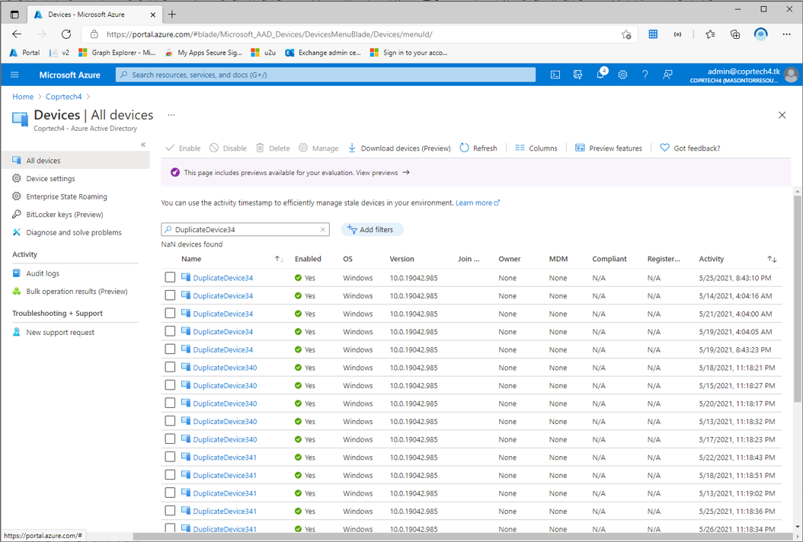

# Create-Devices

This sciprt will create a lot of device objects in Azure AD. 1 every 2 seconds.

# CleanUp-StaleDevices

### Scenario

The purpose of this script is to help delete stale or old devices that exist in Azure AD that are no longer valid. 

In the screenshot below we can see many devivces with the same name. Only the latest deivce is valid.

The script collects all Azure AD devices and puts each device into a 'bucket' with other devices that have the same name. It then identifies the most recent device in each bucket. You can export the results to CSV or JSON to double check or manipulate the data, then import any updates you've made. Finally, you can delete the stale devices.



### Script


This script does the following without the need to install any PowerShell Modules.
1. Get all devices from Azure AD
   - Creates a hashtable containing all **unique** device names. 
     - Each Unique device will contain one or more child obejct. These child objects represent each device with the same name.
   - Loops through each unique device.
     - Finds the child device with the most recent creation date and sets **DeviceStatus** to **Do Not Delete** (this is a local variable in the script)
   - **a** Export the hashtable of devices as a csv file.
   - **b** Export the hashtbale of devices as a json file.
2. Imports CSV file. Using the template exported from option **1a** - amend the CSV and import
3. Imports JSON file. Using the template exported from option **1b** - amend the JSON and import
4. Loops through all unique devices from step 1, 2 or 3 and deletes all devices except for the devices marked **Do Not Delete**
    - Calls Microsoft Graph API in batches to speed up deletion of objects. 20 devices at a time will be deleted.
    - **This cannot be undone** use at own risk.
9. Exit script.

**Notes**
- This script uses device authentication flow to obtain a Access Token with Delegate permissions to the Microsoft Graph API scope Directory.AccessAsUser.All.
  -   Client ID, Client Secret and Tenant ID are used to obtain a new Access Token using the Refresh token from previous requests.
- No PowerShell modules are required as all calls ustilise built in HTTP methods Invoke-WebRequest or Invoke-RESTMethod

### Example JSON output of device to be deleted

```javascript
{
  "DuplicateDevice45": {
    "d47092b1-2891-4ef7-acc2-5c6f5f683a36": {
      "displayName": "DuplicateDevice45",
      "objectId": "d47092b1-2891-4ef7-acc2-5c6f5f683a36",
      "createdDateTime": "2021-05-25T01:56:20Z",
      "registrationDateTime": null,
      "deviceId": "dbc7a6c8-8a6a-4c3b-9ff8-07a2ef81455a",
      "deleteStatus": ""
    },
    "09d7ce8f-4c47-4cb0-ab9b-1da95d6a8477": {
      "displayName": "DuplicateDevice45",
      "objectId": "09d7ce8f-4c47-4cb0-ab9b-1da95d6a8477",
      "createdDateTime": "2021-05-25T02:52:42Z",
      "registrationDateTime": null,
      "deviceId": "17d8dea7-994b-4634-a13a-78972b05656c",
      "deleteStatus": ""
    },
    "9127db17-78ed-4348-ba25-c975e5604bc9": {
      "displayName": "DuplicateDevice45",
      "objectId": "9127db17-78ed-4348-ba25-c975e5604bc9",
      "createdDateTime": "2021-05-25T02:52:33Z",
      "registrationDateTime": null,
      "deviceId": "29d7ee53-b7a0-47fa-b140-75a9e8de6333",
      "deleteStatus": ""
    },
    "c2fb3b08-f623-4eb6-b7a6-50be7b6656c1": {
      "displayName": "DuplicateDevice45",
      "objectId": "c2fb3b08-f623-4eb6-b7a6-50be7b6656c1",
      "createdDateTime": "2021-05-25T02:53:01Z",
      "registrationDateTime": null,
      "deviceId": "836ede1a-2b96-4bde-ab0b-e7db7467b015",
      "deleteStatus": "Do Not Delete"
    }
  },
  "DuplicateDevice34": {
    "66cf7fd4-dfcf-400f-9226-2bb6d3396b72": {
      "displayName": "DuplicateDevice34",
      "objectId": "66cf7fd4-dfcf-400f-9226-2bb6d3396b72",
      "createdDateTime": "2021-05-25T01:50:50Z",
      "registrationDateTime": null,
      "deviceId": "2fa010b8-8212-474a-b2b3-48319978ffd7",
      "deleteStatus": ""
    },
    "a87f9f7d-9998-4f81-b1a5-a62449f09790": {
      "displayName": "DuplicateDevice34",
      "objectId": "a87f9f7d-9998-4f81-b1a5-a62449f09790",
      "createdDateTime": "2021-05-25T02:47:19Z",
      "registrationDateTime": null,
      "deviceId": "febfca4b-f661-4bb6-a529-d962b4a9511e",
      "deleteStatus": "Do Not Delete"
    }
  }
}

```